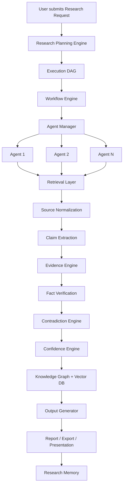

# Data Flow & Research Lifecycle

## End-to-End Research Flow



## Research Request Intake

User provides:

| Field | Example |
|-------|---------|
| Research Objective | "Analyze AI coding market" |
| Research Type | Market analysis, competitive intel, investment memo |
| Depth | Quick scan → deep dive |
| Budget / Deadline / Priority | Cost and time constraints |
| Language / Country / Audience | Localization and tone |
| Output Type | Executive summary, deep report, SWOT, etc. |
| Custom Instructions | Free-form constraints |

## Planning Phase (First Moat)

**Input:** Research objective  
**Output:** Execution DAG containing:

- Questions and sub-questions
- Required sources per question
- Required agents per sub-task
- Expected outputs
- Task dependencies
- Parallel vs sequential execution paths

> The planner produces a **DAG**, not a flat checklist.

## Execution Phase

The Workflow Engine:

1. Topologically sorts the DAG
2. Schedules parallel-ready tasks
3. Dispatches agents via Agent Manager
4. Handles retries, timeouts, checkpointing
5. Supports resume after failure and user cancellation
6. Reports progress to frontend via WebSocket/SSE

## Agent Execution Loop

Each agent follows:

```
Plan → Retrieve → Normalize → Extract Claims → Validate → Return Evidence Bundle
```

Agents communicate state through the Agent Manager; they do not call each other directly.

## Evidence Pipeline (Second Moat)

```
Document
  → Split into claims
  → Link each claim to evidence
  → Cross-verify across multiple sources
  → Detect contradictions
  → Score confidence
  → Store in Knowledge Graph + Vector DB
```

**Example:**

```
Claim: "Cursor raised $900M"
  ├── Evidence A (TechCrunch, primary)
  ├── Evidence B (Crunchbase)
  └── Evidence C (Company blog)
        → Confidence: 0.94
```

## Output Phase

Report Generator produces:

- Executive Summary
- Deep Report
- Investment Memo / Market Report / Technical Review
- SWOT, PESTLE, Porter's Five Forces
- Competitive Matrix, Landscape Analysis

Visualization Engine adds: market maps, funding timelines, heatmaps, network graphs.

Presentation Generator (Phase 3): Auto PPT with speaker notes, charts, references.

## Post-Research

- Findings stored in Research Memory
- Entities merged via Entity Resolution
- Knowledge Graph updated
- Available for semantic search in future projects (Phase 2+)
