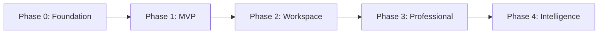

# Development Phases

ResearchSoul is built in five phases. **Do not skip Phase 0** — it provides the foundation every later phase depends on.

| Phase | Name | Timeline | Status |
|-------|------|----------|--------|
| [0](./phase-0-foundation.md) | Platform Foundation | — | Not started |
| [1](./phase-1-mvp.md) | MVP | 8–12 weeks | Not started |
| [2](./phase-2-workspace.md) | Research Workspace | — | Not started |
| [3](./phase-3-professional.md) | Professional Platform | — | Not started |
| [4](./phase-4-intelligence.md) | Intelligence Platform | — | Not started |

## Phase Dependency Graph

## Guiding Rules

1. **Phase 0 before anything else** — Auth, storage, jobs, LLM abstraction, observability.
2. **MVP proves the moats** — Planning DAG + Evidence pipeline must work in Phase 1.
3. **No premature optimization** — pgvector before dedicated vector DB; modular monolith before microservices.
4. **Each phase is shippable** — Users get value at the end of Phase 1 (research reports with citations).

## Next Step

When ready to build, start with [Phase 0 — Platform Foundation](./phase-0-foundation.md).
