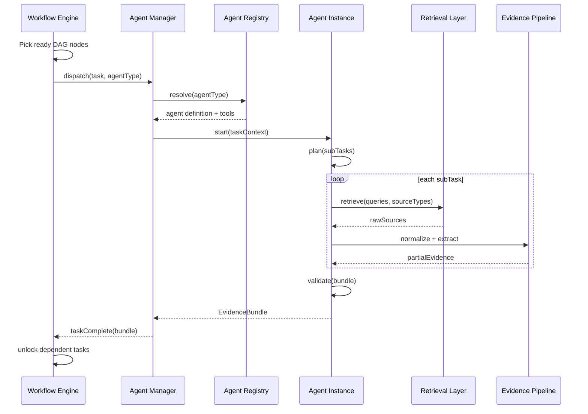

# Agent Orchestration Workflow

## Overview

Agents never call each other directly. The **Workflow Engine** schedules tasks; the **Agent Manager** runs agent instances; agents return **Evidence Bundles** to the orchestrator.

## Sequence



## Agent Internal Loop

Each agent implements:

1. **Plan** — Break task into sub-queries and source requirements
2. **Retrieve** — Call Retrieval Layer with domain-specific queries
3. **Process** — Normalize documents, extract domain-relevant claims
4. **Validate** — Check completeness, reject low-quality output
5. **Return** — Evidence bundle with metadata (agent type, task ID, timestamps)

## Parallelism Rules

- Tasks with no mutual dependency run concurrently
- Agent Manager enforces per-org concurrency limits
- Same agent type can have multiple instances for different tasks
- Shared retrieval results cached by query hash (Redis)

## Agent Registry

Registry entries define:

```yaml
agentType: market
capabilities: [tam_sam_som, market_segments, growth_rates]
defaultSources: [web, news, reports]
maxConcurrency: 3
estimatedCostTier: medium
```

Planner uses registry to assign agents to DAG nodes.

## Communication

- Agents report progress via Agent Manager → Workflow Engine → SSE
- Agents do not share memory; context passed via task payload
- LangGraph manages internal agent state within a single run

## Failure Handling

| Failure | Action |
|---------|--------|
| Retrieval API down | Retry with backoff; fallback source type if configured |
| Agent validation fail | Retry with refined prompt (max 2) |
| Agent timeout | Kill instance; task marked failed; checkpoint saved |
| Partial evidence | Return partial bundle; Confidence Engine marks low-confidence sections |
