# Evidence Pipeline Workflow

The evidence pipeline is ResearchSoul's **second moat**. It ensures every statement in a report is traceable and scored.

## Pipeline Stages

```mermaid
flowchart LR
    A[Raw Source] --> B[Normalize Document]
    B --> C[Chunk Content]
    C --> D[Extract Claims]
    D --> E[Link Evidence]
    E --> F[Deduplicate]
    F --> G[Cross-Verify]
    G --> H[Detect Contradictions]
    H --> I[Score Confidence]
    I --> J[Format Citations]
    J --> K[Evidence Bundle]
```



## Stage Details

### 1. Normalize Document
- Input: RawSource from retrieval
- Output: Document with metadata + reliability score
- Module: [09-source-normalization](../modules/09-source-normalization.md)

### 2. Chunk Content
- Split long documents for LLM processing
- Preserve section boundaries and page numbers for citation anchors

### 3. Extract Claims
- LLM extracts atomic factual claims per chunk
- Each claim references source document ID and text span
- Module: [12-claim-extraction](../modules/12-claim-extraction.md)

### 4. Link Evidence
- Match claims to supporting text spans in same or other documents
- Multiple evidence records per claim encouraged
- Module: [10-evidence-engine](../modules/10-evidence-engine.md)

### 5. Deduplicate
- Merge semantically identical claims from different agents/tasks
- Preserve all evidence links on merged claim

### 6. Cross-Verify
- Compare claim across all linked evidence
- Check consistency, freshness, authority
- Module: [13-fact-verification](../modules/13-fact-verification.md)

### 7. Detect Contradictions
- Find claim pairs that conflict
- Generate explanation and store alternative viewpoints
- Module: [14-contradiction-engine](../modules/14-contradiction-engine.md)

### 8. Score Confidence
- Composite score from authority, agreement, recency, evidence count, citation quality
- Module: [15-confidence-engine](../modules/15-confidence-engine.md)

### 9. Format Citations
- Apply style (APA default) for report embedding
- Module: [11-citation-engine](../modules/11-citation-engine.md)

## Output: Evidence Bundle

```json
{
  "researchId": "...",
  "claims": [
    {
      "id": "...",
      "text": "Cursor raised $900M in Series C",
      "confidence": 0.94,
      "verificationStatus": "verified",
      "evidence": [
        { "documentId": "...", "span": "...", "citation": "..." }
      ],
      "contradictions": []
    }
  ],
  "entities": [],
  "metadata": { "claimCount": 142, "avgConfidence": 0.81 }
}
```

## Report Integration

Report Generator:
- Includes only claims above configurable confidence threshold (default 0.6)
- Surfaces contradictions in dedicated section
- Footnotes/endnotes link to full evidence chain
- Low-confidence claims marked with qualifier language

## Quality Gates

Before report generation:
1. Minimum evidence count per major section
2. No unsourced claims in final output
3. Contradictions explicitly addressed, not silently merged
